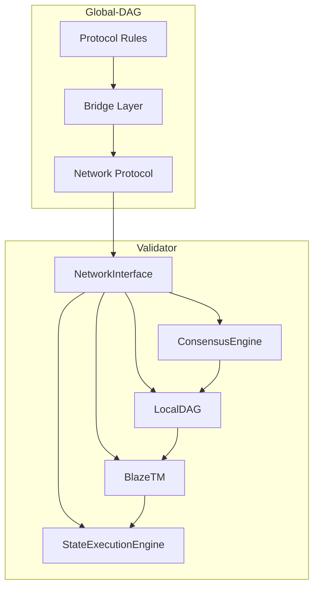
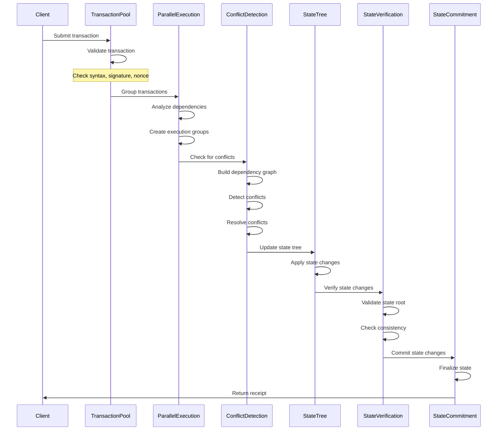
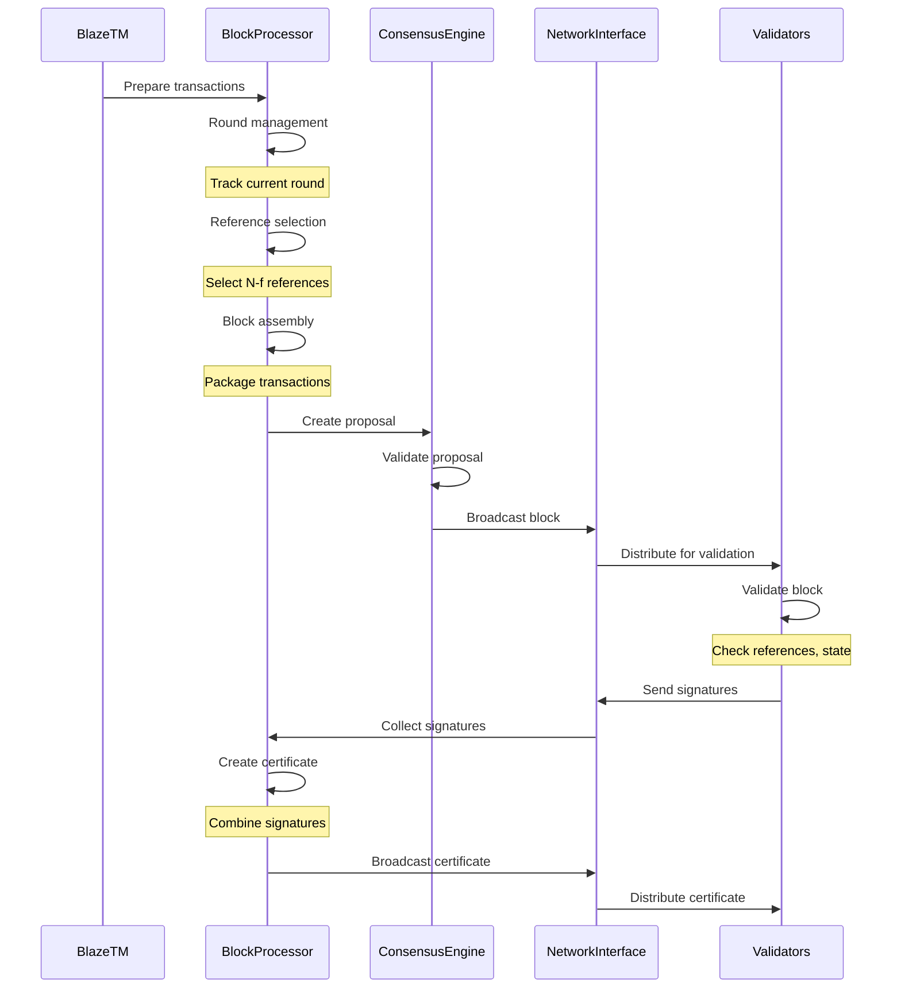
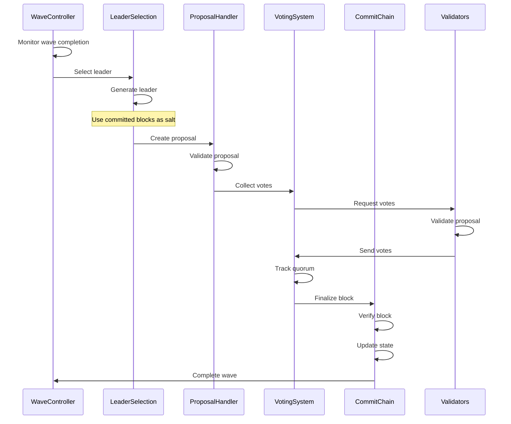
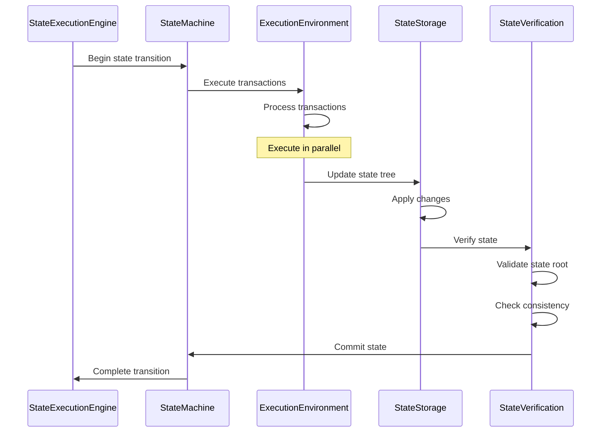
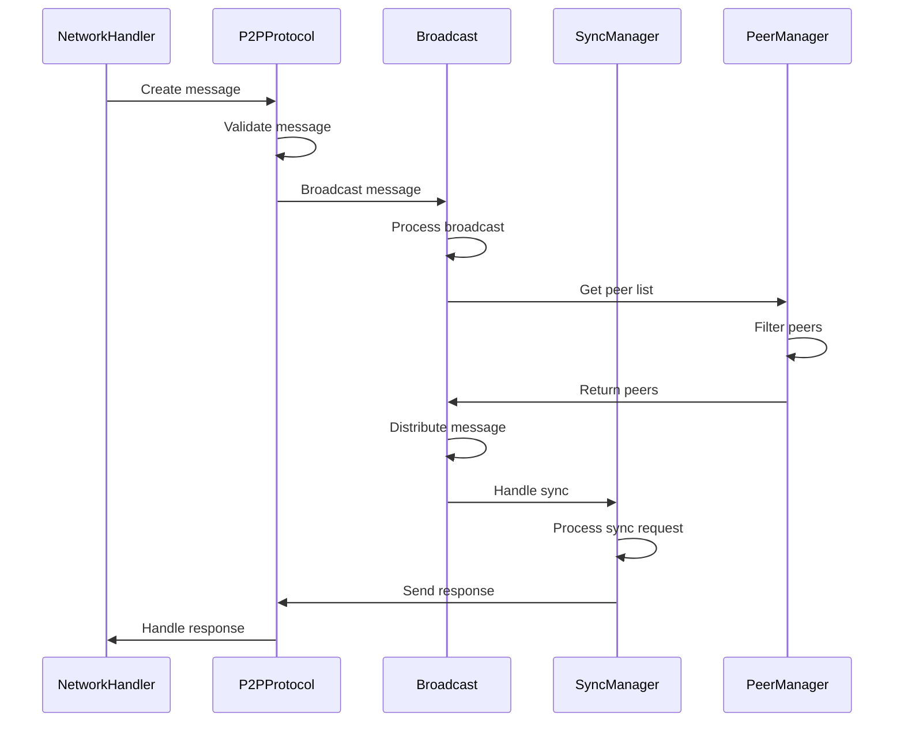
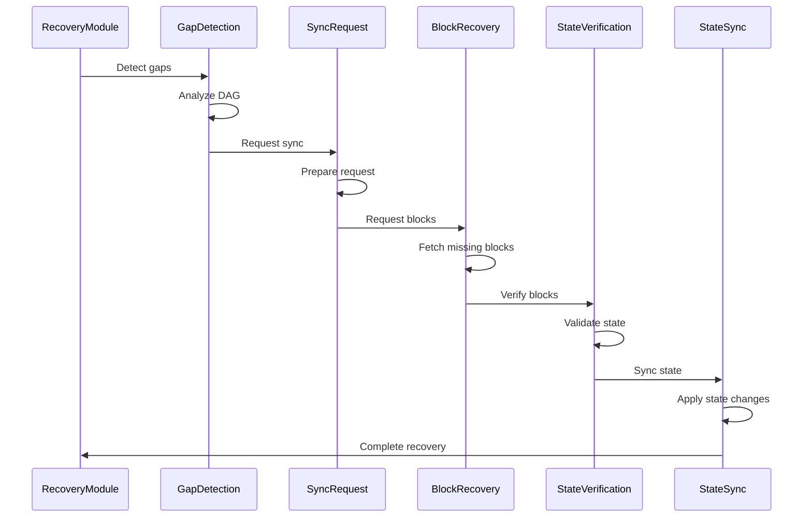

## Table of Contents
1. System Overview
2. Architecture Diagrams
3. Architecture Components
4. Data Structures
5. Protocol Specifications
   - 5.1 Block Creation Protocol
   - 5.2 Consensus Protocol
   - 5.3 State Management Protocol
   - 5.4 Transaction Processing Protocol
   - 5.5 Network Protocol
6. Security Model
7. Performance Considerations

## 1. System Overview

### 1.1 Purpose
BlazeDAG is a proof-of-concept implementation demonstrating a novel DAG-based blockchain architecture with the following key features:
- EVM compatibility
- Zero message overhead consensus
- Commit chain length of 2
- Independent DAG transport layer
- Parallel transaction execution
- Wave-based consensus model

### 1.2 System Architecture
The system is divided into two main layers:
1. Global-DAG (Protocol-Level) Components
2. Validator Components

### 1.3 Key Components
- LocalDAG: Manages local DAG state and operations
- BlazeTM: Transaction management and execution engine
- ConsensusEngine: Handles wave-based consensus
- NetworkInterface: Manages P2P communication
- StateExecutionEngine: Handles EVM state transitions

## Architecture Diagrams

### 2.1 High-Level System Architecture


### 2.2 Detailed Transaction Processing Workflow


### 2.3 Detailed Block Creation Workflow


### 2.4 Detailed Wave Consensus Workflow


### 2.5 Detailed State Management Workflow


### 2.6 Detailed Network Communication Workflow


### 2.7 Detailed Recovery Workflow


## Architecture Components

### 3.1 Global-DAG Components

#### 3.1.1 Protocol Rules
```typescript
interface ProtocolRules {
  consensusConfig: {
    systemParams: {
      totalValidators: number;      // N
      faultTolerance: number;       // f
      quorumSize: number;          // 2f+1
    };
    timingParams: {
      roundDuration: number;       // in milliseconds
      waveTimeout: number;         // in milliseconds
      syncBounds: number;          // maximum allowed sync delay
    };
    securityParams: {
      signatureScheme: string;     // e.g., "BLS"
      cryptoPrimitives: string[];  // list of cryptographic primitives
      keyManagementRules: object;  // key management specifications
    };
  };
  blockRules: {
    structure: {
      headerFormat: object;        // block header specification
      referenceRequirements: number; // N-f
      sizeLimits: {
        maxBlockSize: number;
        maxTxCount: number;
      };
    };
    validation: {
      referenceValidation: object; // reference validation rules
      certificateRequirements: object; // certificate specifications
      causalOrdering: object;      // ordering rules
    };
    finality: {
      commitRequirements: object;  // commit specifications
      confirmationDepth: number;   // required confirmation depth
      stateFinalization: object;   // state finalization rules
    };
  };
}
```

#### 3.1.2 Bridge Layer
```typescript
interface BridgeLayer {
  evmCompatibility: {
    stateTranslation: {
      accountMapping: object;      // account mapping rules
      storageMapping: object;      // storage mapping rules
      addressSpace: object;        // address space management
    };
    transactionHandling: {
      formatConversion: object;    // format conversion rules
      gasTranslation: object;      // gas translation rules
      receiptProcessing: object;   // receipt processing rules
    };
    smartContractInterface: {
      bytecodeCompatibility: object; // bytecode compatibility rules
      abiHandling: object;          // ABI handling rules
      eventProcessing: object;      // event processing rules
    };
  };
  crossChainProtocol: {
    assetBridge: {
      lockUnlock: object;          // lock/unlock mechanism
      assetMapping: object;        // asset mapping rules
      valueTransfer: object;       // value transfer rules
    };
    messageProtocol: {
      crossChainMessaging: object; // messaging rules
      stateVerification: object;   // state verification rules
      relayMechanism: object;      // relay mechanism
    };
    securityControls: {
      bridgeValidators: object;    // bridge validator rules
      thresholdSignatures: object; // threshold signature rules
      emergencyProcedures: object; // emergency procedures
    };
  };
}
```

#### 3.1.3 Network Protocol
```typescript
interface NetworkProtocol {
  messageDefinitions: {
    blockMessages: {
      blockFormat: BlockMessageFormat;
      certificateFormat: CertificateMessageFormat;
      referenceFormat: ReferenceMessageFormat;
    };
    consensusMessages: {
      proposalFormat: ProposalMessageFormat;
      voteFormat: VoteMessageFormat;
      complaintFormat: ComplaintMessageFormat;
    };
    syncMessages: {
      stateSyncFormat: StateSyncMessageFormat;
      dagSyncFormat: DAGSyncMessageFormat;
      checkpointFormat: CheckpointMessageFormat;
    };
  };
  communicationRules: {
    broadcasting: {
      gossipParams: GossipParameters;
      messagePriorities: MessagePriorityRules;
      bandwidthManagement: BandwidthManagementRules;
    };
    p2pProtocol: {
      peerDiscovery: PeerDiscoveryRules;
      connectionManagement: ConnectionManagementRules;
      natTraversal: NATTraversalRules;
    };
    securityProtocol: {
      messageAuth: MessageAuthenticationRules;
      encryption: EncryptionRules;
      dosProtection: DOSProtectionRules;
    };
  };
  synchronizationProtocol: {
    stateSync: {
      checkpointSync: CheckpointSyncRules;
      incrementalSync: IncrementalSyncRules;
      fastSync: FastSyncRules;
    };
    dagSync: {
      blockSync: BlockSyncRules;
      certificateSync: CertificateSyncRules;
      referenceSync: ReferenceSyncRules;
    };
    recoveryProtocol: {
      gapDetection: GapDetectionRules;
      missingBlockRecovery: MissingBlockRecoveryRules;
      stateVerification: StateVerificationRules;
    };
  };
}

interface BlockMessageFormat {
  header: {
    version: number;
    type: MessageType;
    timestamp: number;
    size: number;
  };
  body: {
    block: Block;
    references: Reference[];
    stateRoot: string;
  };
  signature: Signature;
}

interface CertificateMessageFormat {
  header: {
    version: number;
    type: MessageType;
    timestamp: number;
    size: number;
  };
  body: {
    certificate: Certificate;
    blockHash: string;
    signatures: Signature[];
  };
  signature: Signature;
}

interface ReferenceMessageFormat {
  header: {
    version: number;
    type: MessageType;
    timestamp: number;
    size: number;
  };
  body: {
    references: Reference[];
    blockHash: string;
  };
  signature: Signature;
}

interface ProposalMessageFormat {
  header: {
    version: number;
    type: MessageType;
    timestamp: number;
    size: number;
  };
  body: {
    proposal: Proposal;
    round: number;
    wave: number;
  };
  signature: Signature;
}

interface VoteMessageFormat {
  header: {
    version: number;
    type: MessageType;
    timestamp: number;
    size: number;
  };
  body: {
    vote: Vote;
    proposalId: string;
  };
  signature: Signature;
}

interface ComplaintMessageFormat {
  header: {
    version: number;
    type: MessageType;
    timestamp: number;
    size: number;
  };
  body: {
    complaint: Complaint;
    reason: string;
  };
  signature: Signature;
}

interface StateSyncMessageFormat {
  header: {
    version: number;
    type: MessageType;
    timestamp: number;
    size: number;
  };
  body: {
    stateRoot: string;
    stateProof: StateProof;
    blockNumber: number;
  };
  signature: Signature;
}

interface DAGSyncMessageFormat {
  header: {
    version: number;
    type: MessageType;
    timestamp: number;
    size: number;
  };
  body: {
    blockHashes: string[];
    references: Reference[];
    stateRoot: string;
  };
  signature: Signature;
}

interface CheckpointMessageFormat {
  header: {
    version: number;
    type: MessageType;
    timestamp: number;
    size: number;
  };
  body: {
    checkpoint: CheckpointMetadata;
    stateRoot: string;
    blockNumber: number;
  };
  signature: Signature;
}

interface GossipParameters {
  fanout: number;
  gossipInterval: number;
  maxMessageSize: number;
  maxPeers: number;
  minPeers: number;
}

interface MessagePriorityRules {
  priorities: Map<MessageType, number>;
  maxQueueSize: number;
  timeout: number;
}

interface BandwidthManagementRules {
  maxBandwidth: number;
  rateLimit: number;
  burstSize: number;
}

interface PeerDiscoveryRules {
  bootstrapNodes: string[];
  discoveryInterval: number;
  maxPeers: number;
  minPeers: number;
}

interface ConnectionManagementRules {
  maxConnections: number;
  connectionTimeout: number;
  keepAliveInterval: number;
}

interface NATTraversalRules {
  stunServers: string[];
  portMapping: boolean;
  holePunching: boolean;
}

interface MessageAuthenticationRules {
  signatureScheme: string;
  keyRotation: number;
  maxSignatureAge: number;
}

interface EncryptionRules {
  algorithm: string;
  keySize: number;
  keyExchange: string;
}

interface DOSProtectionRules {
  rateLimit: number;
  maxConnections: number;
  blacklistDuration: number;
}

interface CheckpointSyncRules {
  checkpointInterval: number;
  maxCheckpointSize: number;
  verificationRequired: boolean;
}

interface IncrementalSyncRules {
  maxBatchSize: number;
  verificationRequired: boolean;
  retryLimit: number;
}

interface FastSyncRules {
  maxBatchSize: number;
  verificationRequired: boolean;
  parallelDownloads: number;
}

interface BlockSyncRules {
  maxBatchSize: number;
  verificationRequired: boolean;
  retryLimit: number;
}

interface CertificateSyncRules {
  maxBatchSize: number;
  verificationRequired: boolean;
  retryLimit: number;
}

interface ReferenceSyncRules {
  maxBatchSize: number;
  verificationRequired: boolean;
  retryLimit: number;
}

interface GapDetectionRules {
  maxGapSize: number;
  detectionInterval: number;
  recoveryTimeout: number;
}

interface MissingBlockRecoveryRules {
  maxRequestSize: number;
  retryLimit: number;
  timeout: number;
}

interface StateVerificationRules {
  verificationMethod: string;
  proofRequired: boolean;
  timeout: number;
}

interface PeerManager {
  peerDiscovery: {
    discoverPeers: () => Promise<string[]>;
    validatePeer: (peerId: string) => Promise<boolean>;
    trackPeerStatus: (peerId: string) => Promise<PeerStatus>;
  };
  connectionManagement: {
    connect: (peerId: string) => Promise<void>;
    disconnect: (peerId: string) => Promise<void>;
    maintainConnection: (peerId: string) => Promise<void>;
  };
  peerList: {
    getActivePeers: () => Promise<string[]>;
    getPeerInfo: (peerId: string) => Promise<PeerInfo>;
    updatePeerList: () => Promise<void>;
  };
  peerMetrics: {
    trackLatency: (peerId: string) => Promise<number>;
    trackBandwidth: (peerId: string) => Promise<BandwidthMetrics>;
    trackReliability: (peerId: string) => Promise<number>;
  };
}

interface PeerStatus {
  isActive: boolean;
  lastSeen: number;
  connectionQuality: number;
  syncStatus: SyncStatus;
}

interface PeerInfo {
  id: string;
  address: string;
  capabilities: string[];
  version: string;
  lastSeen: number;
}

interface BandwidthMetrics {
  upload: number;
  download: number;
  lastUpdate: number;
}

enum SyncStatus {
  SYNCED = 0,
  SYNCING = 1,
  BEHIND = 2,
  AHEAD = 3,
  UNKNOWN = 4
}
```

### 3.2 Validator Components

#### 3.2.1 Local Storage & Processing
```typescript
interface LocalDAG {
  blockStore: {
    unorderedBlocks: Map<string, Block>;    // blocks not yet ordered
    orderedBlocks: Map<string, Block>;       // blocks in final order
    blockCertificates: Map<string, Certificate>; // block certificates
  };
  referenceManager: {
    blockReferences: Map<string, Reference>; // block references
    causalRelationships: Map<string, string[]>; // causal relationships
  };
  stateManager: {
    currentRound: number;          // current round number
    currentWave: number;           // current wave number
    localState: State;            // local state
  };
}
```

#### 3.2.2 Consensus Components
```typescript
interface ConsensusEngine {
  proposalHandler: {
    createProposals: (round: number) => Promise<Proposal>;  // when leader
    validateProposals: (proposal: Proposal) => Promise<boolean>;
    trackProposalStatus: (proposalId: string) => Promise<ProposalStatus>;
  };
  votingSystem: {
    generateVotes: (proposal: Proposal) => Promise<Vote>;
    collectVotes: (proposalId: string) => Promise<Vote[]>;
    trackQuorum: (proposalId: string) => Promise<boolean>;
  };
  commitChain: {
    blockFinalization: (block: Block) => Promise<void>;
    stateUpdates: (block: Block) => Promise<void>;
    commitRound: (round: number) => Promise<void>;
  };
  waveController: {
    waveState: WaveState;
    waveTransition: WaveTransition;
    waveSync: WaveSync;
  };
}
```

#### 3.2.3 Safety Mechanisms
```typescript
interface SafetySystem {
  complaintHandler: {
    generateComplaints: (block: Block) => Promise<Complaint>;
    processComplaints: (complaint: Complaint) => Promise<void>;
    timeoutMonitoring: TimeoutMonitor;
  };
  certificateManager: {
    createCertificates: (block: Block) => Promise<Certificate>;
    verifyCertificates: (cert: Certificate) => Promise<boolean>;
    trackSignatures: (blockId: string) => Promise<Signature[]>;
  };
  recoveryModule: {
    stateSync: StateSync;
    dagSync: DAGSync;
    waveRecovery: WaveRecovery;
  };
}
```

#### 3.2.4 Network Interface
```typescript
interface NetworkLayer {
  messageHandler: MessageHandler;
  syncManager: SyncManager;  // Use unified interface
}
```

#### 3.2.5 Block Creation & Certification
```typescript
interface BlockProcessor {
  blockCreation: {
    roundManagement: {
      currentRound: number;
      roundTiming: RoundTiming;
    };
    referenceSelection: {
      selectReferences: (round: number) => Promise<Reference[]>;
      verifyReferences: (refs: Reference[]) => Promise<boolean>;
      trackCertificates: (refs: Reference[]) => Promise<Certificate[]>;
    };
    blockAssembly: {
      packageTransactions: (txs: Transaction[]) => Promise<Block>;
      createHeader: (block: Block) => Promise<BlockHeader>;
      signBlock: (block: Block) => Promise<SignedBlock>;
    };
  };
  certificateCreation: {
    signatureCollection: {
      broadcastBlock: (block: Block) => Promise<void>;
      collectSignatures: (blockId: string) => Promise<Signature[]>;
      trackSignatureCount: (blockId: string) => Promise<number>;
    };
    certificateAssembly: {
      combineSignatures: (sigs: Signature[]) => Promise<Certificate>;
      createCertificate: (block: Block, sigs: Signature[]) => Promise<Certificate>;
      verifyCertificate: (cert: Certificate) => Promise<boolean>;
    };
    certificateDistribution: {
      broadcastCertificate: (cert: Certificate) => Promise<void>;
      trackAcknowledgments: (certId: string) => Promise<boolean>;
    };
  };
  roundProgression: {
    monitorCompletion: (round: number) => Promise<boolean>;
    verifyCertificates: (round: number) => Promise<boolean>;
    prepareNextRound: (round: number) => Promise<void>;
  };
}
```

#### 3.2.6 BlazeTM Engine
```typescript
interface BlazeTMEngine {
  transactionPool: {
    mempool: {
      pendingTransactions: Transaction[];
      validatedTransactions: Transaction[];
      priorityQueue: PriorityQueue<Transaction>;
      addTransaction: (tx: Transaction) => Promise<void>;
      removeTransaction: (txHash: string) => Promise<void>;
      getTransaction: (txHash: string) => Promise<Transaction>;
      getPendingTransactions: () => Promise<Transaction[]>;
      getValidatedTransactions: () => Promise<Transaction[]>;
      getNextTransaction: () => Promise<Transaction>;
      updateTransactionPriority: (txHash: string, priority: number) => Promise<void>;
    };
    validation: {
      syntaxValidation: (tx: Transaction) => Promise<boolean>;
      signatureVerification: (tx: Transaction) => Promise<boolean>;
      nonceChecking: (tx: Transaction) => Promise<boolean>;
      validateTransaction: (tx: Transaction) => Promise<ValidationResult>;
      batchValidateTransactions: (txs: Transaction[]) => Promise<ValidationResult[]>;
      getValidationErrors: (txHash: string) => Promise<string[]>;
    };
  };
  speculativeExecution: {
    executionQueue: {
      dependencies: DependencyGraph;
      parallelGroups: ExecutionGroup[];
      conflictDetection: ConflictDetector;
      addExecutionGroup: (group: ExecutionGroup) => Promise<void>;
      removeExecutionGroup: (groupId: string) => Promise<void>;
      getExecutionGroup: (groupId: string) => Promise<ExecutionGroup>;
      getNextExecutionGroup: () => Promise<ExecutionGroup>;
      updateDependencies: (groupId: string, deps: DependencyGraph) => Promise<void>;
      detectConflicts: (groupId: string) => Promise<Conflict[]>;
    };
    stateManagement: {
      speculativeStates: Map<string, State>;
      stateSnapshots: Map<string, StateSnapshot>;
      rollbackPoints: Map<string, State>;
      createStateSnapshot: (groupId: string) => Promise<string>;
      restoreStateSnapshot: (snapshotId: string) => Promise<void>;
      getSpeculativeState: (groupId: string) => Promise<State>;
      updateSpeculativeState: (groupId: string, state: State) => Promise<void>;
      createRollbackPoint: (groupId: string) => Promise<string>;
      rollbackToPoint: (pointId: string) => Promise<void>;
    };
    conflictResolution: {
      dependencyGraph: DependencyGraph;
      conflictMatrix: ConflictMatrix;
      resolutionStrategies: ResolutionStrategy[];
      resolveConflict: (conflict: Conflict) => Promise<ConflictResolution>;
      applyResolution: (resolution: ConflictResolution) => Promise<void>;
      getConflicts: (groupId: string) => Promise<Conflict[]>;
      updateDependencyGraph: (groupId: string, graph: DependencyGraph) => Promise<void>;
      selectResolutionStrategy: (conflict: Conflict) => Promise<ResolutionStrategy>;
    };
  };
  blockIntegration: {
    transactionSelection: {
      gasOptimization: GasOptimizer;
      priorityHandling: PriorityHandler;
      dependencyChecking: DependencyChecker;
      selectTransactions: (maxGas: number) => Promise<Transaction[]>;
      optimizeGasUsage: (txs: Transaction[]) => Promise<Transaction[]>;
      handlePriority: (txs: Transaction[]) => Promise<Transaction[]>;
      checkDependencies: (txs: Transaction[]) => Promise<DependencyGraph>;
      getSelectedTransactions: () => Promise<Transaction[]>;
    };
    blockAssembly: {
      transactionOrdering: TransactionOrderer;
      stateUpdates: StateUpdater;
      blockValidation: BlockValidator;
      orderTransactions: (txs: Transaction[]) => Promise<Transaction[]>;
      updateState: (txs: Transaction[]) => Promise<State>;
      validateBlock: (block: Block) => Promise<boolean>;
      assembleBlock: (txs: Transaction[]) => Promise<Block>;
      getBlockState: (blockHash: string) => Promise<State>;
    };
    postExecution: {
      stateCommitment: StateCommitter;
      receiptGeneration: ReceiptGenerator;
      eventProcessing: EventProcessor;
      commitState: (state: State) => Promise<void>;
      generateReceipts: (txs: Transaction[]) => Promise<Receipt[]>;
      processEvents: (events: Event[]) => Promise<void>;
      finalizeBlock: (block: Block) => Promise<void>;
      getBlockReceipts: (blockHash: string) => Promise<Receipt[]>;
    };
  };
  performanceOptimization: {
    parallelProcessing: {
      threadManagement: ThreadManager;
      workloadDistribution: WorkloadDistributor;
      resourceAllocation: ResourceAllocator;
      allocateThread: (task: Task) => Promise<void>;
      distributeWorkload: (tasks: Task[]) => Promise<void>;
      allocateResources: (task: Task) => Promise<void>;
      getThreadStatus: (threadId: string) => Promise<ThreadStatus>;
      getWorkloadMetrics: () => Promise<WorkloadMetrics>;
    };
    cacheManagement: {
      stateCache: StateCache;
      transactionCache: TransactionCache;
      resultCache: ResultCache;
      cacheState: (key: string, state: State) => Promise<void>;
      cacheTransaction: (txHash: string, tx: Transaction) => Promise<void>;
      cacheResult: (key: string, result: any) => Promise<void>;
      getCachedState: (key: string) => Promise<State>;
      getCachedTransaction: (txHash: string) => Promise<Transaction>;
      getCachedResult: (key: string) => Promise<any>;
    };
    metrics: {
      throughputTracking: ThroughputTracker;
      latencyMonitoring: LatencyMonitor;
      resourceUtilization: ResourceMonitor;
      trackThroughput: () => Promise<ThroughputMetrics>;
      trackLatency: () => Promise<LatencyMetrics>;
      trackResources: () => Promise<ResourceMetrics>;
      getPerformanceReport: () => Promise<PerformanceReport>;
    };
  };
}

interface ValidationResult {
  isValid: boolean;
  errors: string[];
  warnings: string[];
}

interface ThreadStatus {
  isActive: boolean;
  currentTask: Task;
  utilization: number;
  lastUpdate: number;
}

interface WorkloadMetrics {
  activeThreads: number;
  queueLength: number;
  averageProcessingTime: number;
  throughput: number;
}

interface PerformanceReport {
  throughput: ThroughputMetrics;
  latency: LatencyMetrics;
  resources: ResourceMetrics;
  timestamp: number;
}

interface ThroughputMetrics {
  transactionsPerSecond: number;
  blocksPerSecond: number;
  bytesPerSecond: number;
  gasPerSecond: number;
  activeConnections: number;
  messageRate: number;
  lastUpdate: number;
}

interface LatencyMetrics {
  averageBlockTime: number;
  averageTransactionTime: number;
  networkLatency: number;
  processingLatency: number;
  validationLatency: number;
  propagationLatency: number;
  lastUpdate: number;
}

interface ErrorMetrics {
  transactionErrors: number;
  blockErrors: number;
  networkErrors: number;
  validationErrors: number;
  consensusErrors: number;
  errorRate: number;
  lastUpdate: number;
}

interface ResourceMetrics {
  memoryUsage: number;
  cpuUsage: number;
  diskUsage: number;
  networkUsage: number;
  threadCount: number;
  queueLength: number;
  lastUpdate: number;
}
```

#### 3.2.7 State Execution Engine
```typescript
interface StateExecutionEngine {
  stateMachine: {
    stateTransitions: StateTransition[];
    stateVerification: StateVerifier;
    stateCommitment: StateCommitter;
  };
  executionEnvironment: {
    transactionExecution: TransactionExecutor;
    smartContractExecution: ContractExecutor;
    stateUpdates: StateUpdater;
  };
  stateStorage: {
    stateTree: StateTree;
    stateCache: StateCache;
    checkpointManagement: CheckpointManager;
  };
}
```

#### 3.2.8 Monitoring System
```typescript
interface MonitoringSystem {
  performanceMetrics: {
    throughputTracking: ThroughputTracker;
    latencyMeasurements: LatencyMonitor;
    blockTimeMonitoring: BlockTimeMonitor;
  };
  networkMetrics: {
    peerConnectivity: PeerMonitor;
    messagePropagation: MessageMonitor;
    bandwidthUsage: BandwidthMonitor;
  };
  systemHealth: {
    validatorStatus: ValidatorMonitor;
    resourceUsage: ResourceMonitor;
    errorTracking: ErrorTracker;
  };
}
```

## Data Structures

### 4.1 Core Data Structures
```typescript
interface Block {
  header: BlockHeader;
  body: BlockBody;
  certificate?: Certificate;
}

interface BlockHeader {
  version: number;
  timestamp: number;
  round: number;
  wave: number;
  height: number;
  parentHash: string;
  references: Reference[];
  stateRoot: string;
  transactionRoot: string;
  receiptRoot: string;
  validator: string;
  signature: Signature;
}

interface BlockBody {
  transactions: Transaction[];
  receipts: Receipt[];
  events: Event[];
}

interface Reference {
  blockHash: string;
  round: number;
  wave: number;
  type: ReferenceType;
}

interface SignedBlock {
  block: Block;
  signature: Signature;
  validator: string;
  timestamp: number;
}

interface Transaction {
  nonce: number;
  from: string;
  to: string;
  value: bigint;
  gasLimit: number;
  gasPrice: bigint;
  data: string;
  signature: Signature;
}

interface Receipt {
  transactionHash: string;
  blockHash: string;
  blockNumber: number;
  from: string;
  to: string;
  contractAddress?: string;
  gasUsed: number;
  status: number;
  logs: Log[];
}

interface Log {
  address: string;
  topics: string[];
  data: string;
  blockNumber: number;
  transactionHash: string;
  logIndex: number;
  blockHash: string;
  transactionIndex: number;
}

interface Event {
  address: string;
  topics: string[];
  data: string;
  blockNumber: number;
  transactionHash: string;
  logIndex: number;
  blockHash: string;
  transactionIndex: number;
}

interface Certificate {
  blockHash: string;
  signatures: Signature[];
  round: number;
  wave: number;
  validatorSet: string[];
  timestamp: number;
}

interface Signature {
  validator: string;
  signature: string;
  timestamp: number;
}

interface State {
  accounts: Map<string, Account>;
  storage: Map<string, Map<string, string>>;
  code: Map<string, string>;
  nonce: Map<string, number>;
  balance: Map<string, bigint>;
}

interface Account {
  nonce: number;
  balance: bigint;
  codeHash: string;
  storageRoot: string;
}
```

### 4.2 Consensus Data Structures
```typescript
interface Proposal {
  id: string;
  round: number;
  wave: number;
  block: Block;
  proposer: string;
  timestamp: number;
  references: Reference[];
  stateRoot: string;
  signature: Signature;
  status: ProposalStatus;
}

interface Vote {
  proposalId: string;
  validator: string;
  round: number;
  wave: number;
  timestamp: number;
  signature: Signature;
  type: VoteType;
}

interface Complaint {
  id: string;
  blockHash: string;
  validator: string;
  round: number;
  wave: number;
  timestamp: number;
  reason: string;
  signature: Signature;
}

interface WaveState {
  currentWave: number;
  waveStartTime: number;
  waveEndTime: number;
  leader: string;
  proposals: Map<string, Proposal>;
  votes: Map<string, Vote[]>;
  waveStatus: WaveStatus;
}

enum ReferenceType {
  STANDARD = 0,
  VOTE = 1,
  COMPLAINT = 2
}

enum ProposalStatus {
  PENDING = 0,
  VALIDATING = 1,
  VALID = 2,
  INVALID = 3,
  CERTIFIED = 4,
  COMMITTED = 5
}

enum VoteType {
  APPROVE = 0,
  REJECT = 1,
  ABSTAIN = 2
}

enum WaveStatus {
  INITIALIZING = 0,
  ACTIVE = 1,
  COMPLETING = 2,
  COMPLETED = 3,
  FAILED = 4
}
```

### 4.3 Execution Data Structures
```typescript
interface ExecutionGroup {
  transactions: Transaction[];
  dependencies: DependencyGraph;
  conflicts: Conflict[];
}

interface ConflictDetector {
  detectConflicts: (transactions: Transaction[]) => Promise<Conflict[]>;
  analyzeDependencies: (transactions: Transaction[]) => Promise<DependencyGraph>;
  validateConflict: (conflict: Conflict) => Promise<boolean>;
  resolveConflict: (conflict: Conflict) => Promise<ConflictResolution>;
  trackConflicts: (txId: string) => Promise<Conflict[]>;
  getConflictHistory: (txId: string) => Promise<Conflict[]>;
  getConflictingTransactions: (txId: string) => Promise<Transaction[]>;
  isConflicting: (tx1: Transaction, tx2: Transaction) => Promise<boolean>;
  getConflictType: (conflict: Conflict) => ConflictType;
  getResolutionStrategy: (conflict: Conflict) => Promise<ResolutionStrategy>;
}

interface ConflictMatrix {
  matrix: Map<string, Map<string, ConflictType>>;
  addConflict: (tx1: string, tx2: string, type: ConflictType) => Promise<void>;
  removeConflict: (tx1: string, tx2: string) => Promise<void>;
  getConflicts: (txId: string) => Promise<Map<string, ConflictType>>;
  hasConflict: (tx1: string, tx2: string) => Promise<boolean>;
  getConflictType: (tx1: string, tx2: string) => Promise<ConflictType>;
  clearConflicts: () => Promise<void>;
}

interface DependencyGraph {
  nodes: Map<string, Transaction>;
  edges: Map<string, string[]>;
  cycles: string[][];
  addNode: (tx: Transaction) => Promise<void>;
  addEdge: (from: string, to: string) => Promise<void>;
  removeNode: (txId: string) => Promise<void>;
  removeEdge: (from: string, to: string) => Promise<void>;
  getDependencies: (txId: string) => Promise<string[]>;
  getDependents: (txId: string) => Promise<string[]>;
  hasCycle: () => Promise<boolean>;
  getCycles: () => Promise<string[][]>;
  validateGraph: () => Promise<boolean>;
}

interface Conflict {
  id: string;
  transactions: Transaction[];
  type: ConflictType;
  resolution: ConflictResolution;
}

interface ConflictResolution {
  strategy: ResolutionStrategy;
  resolvedTransactions: Transaction[];
  droppedTransactions: Transaction[];
}

interface ExecutionResult {
  transactions: Transaction[];
  receipts: Receipt[];
  state: State;
  conflicts: Conflict[];
}

interface StateUpdate {
  state: State;
  changes: Map<string, any>;
  proofs: StateProof[];
}

interface StateProof {
  key: string;
  value: any;
  proof: string[];
  root: string;
}

interface StateTransition {
  preState: State;
  postState: State;
  transactions: Transaction[];
  receipts: Receipt[];
  events: Event[];
  stateRoot: string;
}

enum ConflictType {
  READ_WRITE = 0,
  WRITE_WRITE = 1,
  NONCE = 2,
  BALANCE = 3
}

enum ResolutionStrategy {
  PRIORITY = 0,
  TIMESTAMP = 1,
  RANDOM = 2,
  CONSENSUS = 3
}

interface TransactionExecutor {
  executeTransaction: (tx: Transaction, state: State) => Promise<ExecutionResult>;
  validateTransaction: (tx: Transaction, state: State) => Promise<boolean>;
  estimateGas: (tx: Transaction, state: State) => Promise<number>;
  getTransactionReceipt: (txHash: string) => Promise<Receipt>;
  getTransactionStatus: (txHash: string) => Promise<TransactionStatus>;
  revertTransaction: (tx: Transaction, state: State) => Promise<void>;
  batchExecuteTransactions: (txs: Transaction[], state: State) => Promise<ExecutionResult[]>;
}

interface ContractExecutor {
  deployContract: (tx: Transaction, state: State) => Promise<ContractAddress>;
  executeContract: (tx: Transaction, state: State) => Promise<ExecutionResult>;
  callContract: (address: string, data: string, state: State) => Promise<ExecutionResult>;
  getContractCode: (address: string, state: State) => Promise<string>;
  getContractStorage: (address: string, key: string, state: State) => Promise<string>;
  setContractStorage: (address: string, key: string, value: string, state: State) => Promise<void>;
  validateContract: (address: string, state: State) => Promise<boolean>;
}

interface StateUpdater {
  updateAccount: (address: string, account: Account, state: State) => Promise<void>;
  updateStorage: (address: string, key: string, value: string, state: State) => Promise<void>;
  updateCode: (address: string, code: string, state: State) => Promise<void>;
  updateBalance: (address: string, balance: bigint, state: State) => Promise<void>;
  updateNonce: (address: string, nonce: number, state: State) => Promise<void>;
  batchUpdateState: (updates: StateUpdate[], state: State) => Promise<void>;
  revertState: (state: State, snapshot: StateSnapshot) => Promise<void>;
  commitState: (state: State) => Promise<void>;
}

interface EventProcessor {
  emitEvent: (event: Event) => Promise<void>;
  processEvent: (event: Event) => Promise<void>;
  getEventLogs: (filter: EventFilter) => Promise<Event[]>;
  subscribeToEvents: (filter: EventFilter, callback: (event: Event) => void) => Promise<Subscription>;
  unsubscribeFromEvents: (subscription: Subscription) => Promise<void>;
  validateEvent: (event: Event) => Promise<boolean>;
  batchProcessEvents: (events: Event[]) => Promise<void>;
}

interface EventFilter {
  address?: string;
  topics?: string[];
  fromBlock?: number;
  toBlock?: number;
}

interface Subscription {
  id: string;
  filter: EventFilter;
  callback: (event: Event) => void;
  isActive: boolean;
}

interface TransactionStatus {
  hash: string;
  status: 'pending' | 'processing' | 'completed' | 'failed' | 'reverted';
  blockNumber?: number;
  error?: string;
  gasUsed?: number;
  timestamp: number;
}

interface ContractAddress {
  address: string;
  codeHash: string;
  storageRoot: string;
  nonce: number;
  balance: bigint;
}

interface StateTree {
  root: string;
  getValue: (path: string[]) => Promise<string>;
  setValue: (path: string[], value: string) => Promise<void>;
  deleteValue: (path: string[]) => Promise<void>;
  getProof: (path: string[]) => Promise<StateProof>;
  verifyProof: (proof: StateProof) => Promise<boolean>;
  commit: () => Promise<string>;
  rollback: (root: string) => Promise<void>;
  getRoot: () => Promise<string>;
  batchUpdate: (updates: Map<string[], string>) => Promise<void>;
}

interface StateCache {
  get: (key: string) => Promise<State>;
  set: (key: string, state: State) => Promise<void>;
  delete: (key: string) => Promise<void>;
  has: (key: string) => Promise<boolean>;
  clear: () => Promise<void>;
  getSize: () => Promise<number>;
  getKeys: () => Promise<string[]>;
  invalidate: (key: string) => Promise<void>;
  batchGet: (keys: string[]) => Promise<Map<string, State>>;
  batchSet: (entries: Map<string, State>) => Promise<void>;
}

interface CheckpointManager {
  createCheckpoint: (state: State) => Promise<string>;
  restoreCheckpoint: (checkpointId: string) => Promise<void>;
  deleteCheckpoint: (checkpointId: string) => Promise<void>;
  listCheckpoints: () => Promise<string[]>;
  getCheckpointState: (checkpointId: string) => Promise<State>;
  validateCheckpoint: (checkpointId: string) => Promise<boolean>;
  mergeCheckpoints: (sourceId: string, targetId: string) => Promise<void>;
  getCheckpointMetadata: (checkpointId: string) => Promise<CheckpointMetadata>;
}

interface CheckpointMetadata {
  id: string;
  timestamp: number;
  stateRoot: string;
  blockNumber: number;
  blockHash: string;
  size: number;
  parentId?: string;
}
```

### 4.4 Network Data Structures
```typescript
interface NetworkMessage {
  type: MessageType;
  payload: any;
  signature: Signature;
  timestamp: number;
  sender: string;
  recipient?: string;
  priority: number;
  ttl: number;
}

interface SyncRequest {
  type: SyncRequestType;
  startBlock: string;
  endBlock: string;
  stateRoot: string;
  timestamp: number;
  signature: Signature;
}

interface SyncResponse {
  type: SyncResponseType;
  blocks: Block[];
  stateRoot: string;
  timestamp: number;
  signature: Signature;
}

interface RecoveryRequest {
  type: RecoveryRequestType;
  missingBlocks: string[];
  stateRoot: string;
  timestamp: number;
  signature: Signature;
}

interface RecoveryResponse {
  type: RecoveryResponseType;
  blocks: Block[];
  stateRoot: string;
  timestamp: number;
  signature: Signature;
}

enum MessageType {
  BLOCK = 0,
  VOTE = 1,
  CERTIFICATE = 2,
  COMPLAINT = 3,
  SYNC_REQUEST = 4,
  SYNC_RESPONSE = 5,
  RECOVERY_REQUEST = 6,
  RECOVERY_RESPONSE = 7
}

enum SyncRequestType {
  FULL = 0,
  INCREMENTAL = 1,
  FAST = 2
}

enum SyncResponseType {
  FULL = 0,
  INCREMENTAL = 1,
  FAST = 2
}

enum RecoveryRequestType {
  BLOCK = 0,
  STATE = 1,
  CERTIFICATE = 2
}

enum RecoveryResponseType {
  BLOCK = 0,
  STATE = 1,
  CERTIFICATE = 2
}
```

### 4.5 Resource Management Data Structures
```typescript
interface ResourceMetrics {
  memoryUsage: MemoryMetrics;
  cpuUsage: CPUMetrics;
  networkUsage: NetworkMetrics;
  diskUsage: DiskMetrics;
}

interface MemoryMetrics {
  total: number;
  used: number;
  free: number;
  peak: number;
  lastUpdate: number;
}

interface CPUMetrics {
  total: number;
  used: number;
  idle: number;
  peak: number;
  lastUpdate: number;
}

interface NetworkMetrics {
  bandwidth: number;
  connections: number;
  latency: number;
  errors: number;
  lastUpdate: number;
}

interface DiskMetrics {
  total: number;
  used: number;
  free: number;
  iops: number;
  lastUpdate: number;
}

interface Task {
  id: string;
  type: TaskType;
  priority: number;
  dependencies: string[];
  resources: ResourceRequirements;
  status: TaskStatus;
  result?: any;
  error?: string;
}

interface ResourceRequirements {
  memory: number;
  cpu: number;
  network: number;
  disk: number;
}

enum TaskType {
  TRANSACTION = 0,
  BLOCK = 1,
  SYNC = 2,
  RECOVERY = 3
}

enum TaskStatus {
  PENDING = 0,
  RUNNING = 1,
  COMPLETED = 2,
  FAILED = 3
}
```

### 4.6 Monitoring Data Structures
```typescript
interface MonitoringMetrics {
  performance: PerformanceMetrics;
  resources: ResourceMetrics;
  network: NetworkMetrics;
  system: SystemMetrics;
}

interface PerformanceMetrics {
  throughput: ThroughputMetrics;
  latency: LatencyMetrics;
  errors: ErrorMetrics;
}

interface SystemMetrics {
  health: HealthMetrics;
  uptime: UptimeMetrics;
  alerts: AlertMetrics;
}

interface HealthMetrics {
  status: HealthStatus;
  components: Map<string, ComponentHealth>;
  lastCheck: number;
}

interface UptimeMetrics {
  total: number;
  current: number;
  lastRestart: number;
  incidents: Incident[];
}

interface AlertMetrics {
  active: Alert[];
  history: Alert[];
  thresholds: AlertThresholds;
}

interface ComponentHealth {
  status: HealthStatus;
  lastCheck: number;
  errors: string[];
  warnings: string[];
}

interface Incident {
  id: string;
  type: IncidentType;
  startTime: number;
  endTime?: number;
  description: string;
  resolution?: string;
}

interface Alert {
  id: string;
  type: AlertType;
  severity: AlertSeverity;
  timestamp: number;
  description: string;
  resolved: boolean;
}

interface AlertThresholds {
  memory: number;
  cpu: number;
  network: number;
  disk: number;
  latency: number;
  errors: number;
}

enum HealthStatus {
  HEALTHY = 0,
  DEGRADED = 1,
  UNHEALTHY = 2,
  UNKNOWN = 3
}

enum IncidentType {
  HARDWARE = 0,
  SOFTWARE = 1,
  NETWORK = 2,
  SECURITY = 3
}

enum AlertType {
  RESOURCE = 0,
  PERFORMANCE = 1,
  SECURITY = 2,
  SYSTEM = 3
}

enum AlertSeverity {
  INFO = 0,
  WARNING = 1,
  ERROR = 2,
  CRITICAL = 3
}
```

## Protocol Specifications

### 5.1 Block Creation Protocol

#### 5.1.1 Block Creation Process
1. Transaction Collection
   - Collect transactions from TransactionPool
   - Validate transactions using TransactionValidator
   - Group transactions using TransactionGrouper

2. Block Assembly
   - Create block header using BlockHeaderCreator
   - Select references from Global-DAG using ReferenceSelector
     * Must reference N-f previous blocks from Global-DAG
     * References must be from committed blocks
     * References must maintain causal ordering
   - Package transactions using TransactionPackager
   - Sign block using BlockSigner

3. Block Distribution
   - Add block to Global-DAG structure
   - Update Global-DAG tips
   - Broadcast block using NetworkBroadcaster
   - Collect signatures using SignatureCollector
   - Create certificate using CertificateCreator
   - Broadcast certificate using CertificateDistributor

#### 5.1.2 Block Creation Components
```typescript
interface BlockCreation {
  transactionCollection: {
    mempool: TransactionPool;
    validation: TransactionValidator;
    grouping: TransactionGrouper;
  };
  blockAssembly: {
    headerCreation: BlockHeaderCreator;
    referenceSelection: ReferenceSelector;
    transactionPackaging: TransactionPackager;
    blockSigning: BlockSigner;
  };
  blockDistribution: {
    networkBroadcast: NetworkBroadcaster;
    signatureCollection: SignatureCollector;
    certificateCreation: CertificateCreator;
    certificateDistribution: CertificateDistributor;
  };
  globalDAGIntegration: {
    addBlock: (block: Block) => Promise<void>;
    updateTips: (block: Block) => Promise<void>;
    validateReferences: (block: Block) => Promise<boolean>;
    maintainCausalOrder: (block: Block) => Promise<void>;
  };
}

interface ReferenceSelector {
  selectReferences: (round: number) => Promise<Reference[]>;
  validateReferences: (refs: Reference[]) => Promise<boolean>;
  trackCertificates: (refs: Reference[]) => Promise<Certificate[]>;
  getGlobalDAGTips: () => Promise<string[]>;
  getCommittedBlocks: (count: number) => Promise<string[]>;
  validateCausalOrder: (block: Block) => Promise<boolean>;
}

interface BlockHeaderCreator {
  createHeader: (block: Block) => Promise<BlockHeader>;
  validateHeader: (header: BlockHeader) => Promise<boolean>;
  updateHeader: (header: BlockHeader, updates: Partial<BlockHeader>) => Promise<BlockHeader>;
}

interface TransactionPackager {
  packageTransactions: (txs: Transaction[]) => Promise<Block>;
  validatePackage: (block: Block) => Promise<boolean>;
  optimizePackage: (block: Block) => Promise<Block>;
}

interface BlockSigner {
  signBlock: (block: Block) => Promise<SignedBlock>;
  verifySignature: (block: Block) => Promise<boolean>;
  recoverSigner: (block: Block) => Promise<string>;
}

interface NetworkBroadcaster {
  broadcastBlock: (block: Block) => Promise<void>;
  trackBroadcast: (blockId: string) => Promise<boolean>;
  handleAcknowledgments: (blockId: string) => Promise<void>;
}

interface SignatureCollector {
  collectSignatures: (blockId: string) => Promise<Signature[]>;
  validateSignatures: (sigs: Signature[]) => Promise<boolean>;
  trackSignatureCount: (blockId: string) => Promise<number>;
}

interface CertificateCreator {
  createCertificate: (block: Block, sigs: Signature[]) => Promise<Certificate>;
  validateCertificate: (cert: Certificate) => Promise<boolean>;
  combineSignatures: (sigs: Signature[]) => Promise<Certificate>;
}

interface CertificateDistributor {
  broadcastCertificate: (cert: Certificate) => Promise<void>;
  trackDistribution: (certId: string) => Promise<boolean>;
  handleAcknowledgments: (certId: string) => Promise<void>;
}
```

#### 5.1.3 Block Creation Rules
```typescript
interface BlockCreationRules {
  transactionRules: {
    maxTransactionsPerBlock: number;
    minTransactionsPerBlock: number;
    maxBlockSize: number;
    transactionValidation: TransactionValidationRules;
  };
  referenceRules: {
    minReferences: number;        // N-f
    maxReferences: number;
    referenceValidation: ReferenceValidationRules;
    globalDAGRules: {
      mustReferenceCommitted: boolean;
      maintainCausalOrder: boolean;
      referenceAge: number;
      tipSelection: TipSelectionStrategy;
    };
  };
  timingRules: {
    blockCreationTimeout: number;
    signatureCollectionTimeout: number;
    certificateCreationTimeout: number;
  };
  securityRules: {
    signatureRequirements: SignatureRequirements;
    certificateRequirements: CertificateRequirements;
    validatorRequirements: ValidatorRequirements;
  };
}

enum TipSelectionStrategy {
  RANDOM = 0,
  OLDEST = 1,
  MOST_REFERENCED = 2,
  WEIGHTED = 3
}

interface TransactionValidationRules {
  syntaxValidation: boolean;
  signatureValidation: boolean;
  nonceValidation: boolean;
  gasValidation: boolean;
  balanceValidation: boolean;
}

interface ReferenceValidationRules {
  referenceAge: number;
  referenceValidity: boolean;
  referenceCertification: boolean;
}

interface SignatureRequirements {
  minSignatures: number;
  signatureValidity: boolean;
  signatureFreshness: number;
}

interface CertificateRequirements {
  minValidators: number;
  certificateValidity: boolean;
  certificateFreshness: number;
}

interface ValidatorRequirements {
  minActiveValidators: number;
  validatorRotation: boolean;
  validatorStake: bigint;
}
```

### 5.2 Consensus Protocol

#### 5.2.1 Consensus Process
1. Wave Progression
   - Monitor wave completion using WaveController
   - Select leader using Global-DAG state
     * Use committed blocks as salt for leader selection
     * Consider validator participation in Global-DAG
     * Track validator contributions to Global-DAG
   - Validate wave transitions using WaveTransition
   - Update wave state using WaveState

2. Block Finalization
   - Verify block references in Global-DAG
   - Validate certificates using CertificateManager
   - Update Global-DAG state
   - Commit finalized blocks to Global-DAG
   - Update causal ordering in Global-DAG

3. Safety Mechanisms
   - Monitor timeouts using SafetySystem
   - Handle complaints using ComplaintHandler
   - Manage recovery using RecoveryModule
   - Ensure liveness using LivenessMonitor
   - Maintain Global-DAG consistency

#### 5.2.2 Wave-Based Consensus Components
```typescript
interface WaveConsensus {
  waveState: WaveState;
  waveTransition: WaveTransition;
  globalDAGIntegration: {
    getCommittedBlocks: (wave: number) => Promise<Block[]>;
    updateWaveState: (wave: number) => Promise<void>;
    validateWaveTransition: (wave: number) => Promise<boolean>;
    trackValidatorParticipation: (validator: string) => Promise<ValidatorMetrics>;
  };
}

interface WaveState {
  currentWave: number;
  waveStartTime: number;
  waveEndTime: number;
  leader: string;
  proposals: Map<string, Proposal>;
  votes: Map<string, Vote[]>;
  waveStatus: WaveStatus;
  globalDAGState: {
    committedBlocks: Set<string>;
    pendingBlocks: Set<string>;
    waveTips: Map<number, Set<string>>;
    causalOrder: Map<string, number>;
  };
}

interface WaveTransition {
  validateWave: (wave: number) => Promise<boolean>;
  selectLeader: (wave: number) => Promise<string>;
  handleWaveEnd: (wave: number) => Promise<void>;
  prepareNextWave: (wave: number) => Promise<void>;
  globalDAGOperations: {
    getWaveBlocks: (wave: number) => Promise<Block[]>;
    updateWaveTips: (wave: number) => Promise<void>;
    validateWaveConsistency: (wave: number) => Promise<boolean>;
  };
}

interface ValidatorMetrics {
  committedBlocks: number;
  pendingBlocks: number;
  participationRate: number;
  lastContribution: number;
  causalOrderScore: number;
}
```

#### 5.2.3 Leader Selection Components
```typescript
interface LeaderSelection {
  selectLeader: (wave: number) => Promise<string>;
  validateLeader: (leader: string, wave: number) => Promise<boolean>;
  handleLeaderFailure: (leader: string, wave: number) => Promise<void>;
  globalDAGIntegration: {
    getLeaderEligibility: (validator: string) => Promise<boolean>;
    calculateLeaderScore: (validator: string) => Promise<number>;
    trackLeaderPerformance: (leader: string) => Promise<LeaderMetrics>;
  };
}

interface LeaderMetrics {
  blocksProposed: number;
  blocksCommitted: number;
  averageConfirmationTime: number;
  participationRate: number;
  globalDAGContribution: number;
}

interface LeaderValidator {
  validateLeaderEligibility: (leader: string, wave: number) => Promise<boolean>;
  checkLeaderStake: (leader: string) => Promise<boolean>;
  verifyLeaderHistory: (leader: string) => Promise<boolean>;
  globalDAGValidation: {
    checkBlockHistory: (leader: string) => Promise<BlockHistory>;
    validateParticipation: (leader: string) => Promise<boolean>;
    calculateContribution: (leader: string) => Promise<number>;
  };
}

interface BlockHistory {
  totalBlocks: number;
  committedBlocks: number;
  averageConfirmationTime: number;
  participationRate: number;
  lastActive: number;
}
```

#### 5.2.4 Block Finalization Components
```typescript
interface BlockFinalization {
  verifyBlock: (block: Block) => Promise<boolean>;
  collectSignatures: (block: Block) => Promise<Certificate>;
  finalizeBlock: (block: Block) => Promise<void>;
  updateState: (block: Block) => Promise<void>;
  globalDAGOperations: {
    addFinalizedBlock: (block: Block) => Promise<void>;
    updateCausalOrder: (block: Block) => Promise<void>;
    validateFinalization: (block: Block) => Promise<boolean>;
  };
}

interface BlockVerifier {
  verifyBlockReferences: (block: Block) => Promise<boolean>;
  verifyBlockSignatures: (block: Block) => Promise<boolean>;
  verifyBlockState: (block: Block) => Promise<boolean>;
  globalDAGVerification: {
    verifyReferences: (block: Block) => Promise<boolean>;
    validateCausalOrder: (block: Block) => Promise<boolean>;
    checkConsistency: (block: Block) => Promise<boolean>;
  };
}

interface BlockStateManager {
  updateBlockState: (block: Block) => Promise<void>;
  commitBlockState: (block: Block) => Promise<void>;
  rollbackBlockState: (block: Block) => Promise<void>;
  globalDAGStateManagement: {
    updateStateTree: (block: Block) => Promise<void>;
    maintainConsistency: (block: Block) => Promise<void>;
    handleConflicts: (block: Block) => Promise<void>;
  };
}
```

### 5.3 State Management Protocol

#### 5.3.1 State Management Process
1. State Transitions
   - Execute transactions using TransactionExecutor
   - Update account states using StateUpdater
   - Process events using EventProcessor
   - Generate receipts using ReceiptGenerator
   - Track state changes in Global-DAG
   - Maintain causal ordering in Global-DAG

2. State Verification
   - Verify state roots using StateVerifier
   - Validate transitions using StateTransition
   - Check consistency using StateConsistency
   - Handle conflicts using ConflictResolver
   - Validate Global-DAG state consistency
   - Verify causal ordering in Global-DAG

3. State Commitment
   - Commit state changes using StateCommitter
   - Update state tree using StateTree
   - Generate proofs using StateProof
   - Handle rollbacks using StateRollback
   - Update Global-DAG state
   - Maintain Global-DAG consistency

#### 5.3.2 State Management Components
```typescript
interface StateManagement {
  stateMachine: {
    stateTransitions: StateTransition[];
    stateVerification: StateVerifier;
    stateCommitment: StateCommitter;
    globalDAGIntegration: {
      trackStateChanges: (transition: StateTransition) => Promise<void>;
      validateStateConsistency: (block: Block) => Promise<boolean>;
      maintainCausalOrder: (block: Block) => Promise<void>;
    };
  };
  executionEnvironment: {
    transactionExecution: TransactionExecutor;
    smartContractExecution: ContractExecutor;
    stateUpdates: StateUpdater;
    globalDAGOperations: {
      executeInDAG: (block: Block) => Promise<ExecutionResult>;
      validateExecution: (result: ExecutionResult) => Promise<boolean>;
      handleConflicts: (conflicts: Conflict[]) => Promise<void>;
    };
  };
  stateStorage: {
    stateTree: StateTree;
    stateCache: StateCache;
    checkpointManagement: CheckpointManager;
    globalDAGStorage: {
      storeState: (block: Block, state: State) => Promise<void>;
      retrieveState: (block: Block) => Promise<State>;
      validateStorage: (block: Block) => Promise<boolean>;
    };
  };
}

interface StateMachine {
  stateTransitions: StateTransition[];
  stateVerification: StateVerifier;
  stateCommitment: StateCommitter;
  globalDAGIntegration: {
    trackStateChanges: (transition: StateTransition) => Promise<void>;
    validateStateConsistency: (block: Block) => Promise<boolean>;
    maintainCausalOrder: (block: Block) => Promise<void>;
  };
}


interface ExecutionEnvironment {
  transactionExecution: TransactionExecutor;
  smartContractExecution: ContractExecutor;
  stateUpdates: StateUpdater;
  globalDAGOperations: {
    executeInDAG: (block: Block) => Promise<ExecutionResult>;
    validateExecution: (result: ExecutionResult) => Promise<boolean>;
    handleConflicts: (conflicts: Conflict[]) => Promise<void>;
  };
}

interface StateStorage {
  stateTree: StateTree;
  stateCache: StateCache;
  checkpointManagement: CheckpointManager;
  globalDAGStorage: {
    storeState: (block: Block, state: State) => Promise<void>;
    retrieveState: (block: Block) => Promise<State>;
    validateStorage: (block: Block) => Promise<boolean>;
  };
}
```

#### 5.3.3 State Transition Components
```typescript
interface StateTransition {
  preState: State;
  postState: State;
  transactions: Transaction[];
  receipts: Receipt[];
  events: Event[];
  stateRoot: string;
  globalDAGState: {
    blockHash: string;
    wave: number;
    round: number;
    causalOrder: number;
    stateChanges: Map<string, StateChange>;
  };
}

interface StateVerifier {
  verifyStateRoot: (state: State) => Promise<boolean>;
  verifyTransition: (transition: StateTransition) => Promise<boolean>;
  verifyConsistency: (state: State) => Promise<boolean>;
  handleConflicts: (conflicts: Conflict[]) => Promise<void>;
  globalDAGVerification: {
    verifyStateChanges: (block: Block) => Promise<boolean>;
    validateCausalOrder: (block: Block) => Promise<boolean>;
    checkConsistency: (block: Block) => Promise<boolean>;
  };
}

interface StateCommitter {
  commitState: (state: State) => Promise<void>;
  rollbackState: (state: State) => Promise<void>;
  verifyCommitment: (state: State) => Promise<boolean>;
  globalDAGCommitment: {
    commitToDAG: (block: Block, state: State) => Promise<void>;
    updateDAGState: (block: Block) => Promise<void>;
    validateCommitment: (block: Block) => Promise<boolean>;
  };
}

interface StateChange {
  address: string;
  type: StateChangeType;
  oldValue: any;
  newValue: any;
  blockHash: string;
  causalOrder: number;
}

enum StateChangeType {
  ACCOUNT = 0,
  STORAGE = 1,
  CODE = 2,
  BALANCE = 3,
  NONCE = 4
}
```

### 5.4 Transaction Processing Protocol

#### 5.4.1 Transaction Processing Process
1. Transaction Collection
   - Collect from TransactionPool
   - Validate using TransactionValidator
   - Group by dependencies using TransactionGrouper
   - Prioritize using PriorityHandler
   - Analyze Global-DAG dependencies
   - Track Global-DAG conflicts

2. Parallel Execution
   - Create execution groups using ParallelExecution
   - Execute transactions using TransactionExecutor
   - Detect conflicts using ConflictDetection
   - Resolve conflicts using ConflictResolver
   - Maintain Global-DAG causal ordering
   - Track Global-DAG state changes

3. Post Processing
   - Generate receipts using ReceiptGenerator
   - Process events using EventProcessor
   - Update state using StateUpdater
   - Commit changes using StateCommitter
   - Update Global-DAG state
   - Maintain Global-DAG consistency

#### 5.4.2 Transaction Processing Components
```typescript
interface TransactionProcessing {
  transactionPool: TransactionPool;
  executionEngine: {
    parallelExecution: ParallelExecution;
    conflictDetection: ConflictDetection;
    stateUpdates: StateUpdater;
    globalDAGIntegration: {
      analyzeDependencies: (txs: Transaction[]) => Promise<DependencyGraph>;
      detectConflicts: (txs: Transaction[]) => Promise<Conflict[]>;
      maintainOrdering: (txs: Transaction[]) => Promise<void>;
    };
  };
  postProcessing: {
    receiptGeneration: ReceiptGenerator;
    eventProcessing: EventProcessor;
    stateCommitment: StateCommitter;
    globalDAGOperations: {
      updateState: (block: Block) => Promise<void>;
      validateConsistency: (block: Block) => Promise<boolean>;
      handleConflicts: (conflicts: Conflict[]) => Promise<void>;
    };
  };
}

interface TransactionPool {
  pending: Map<string, Transaction>;
  validated: Map<string, Transaction>;
  rejected: Map<string, Transaction>;
  priority: PriorityQueue<Transaction>;
  globalDAGTracking: {
    trackDependencies: (tx: Transaction) => Promise<void>;
    validateConflicts: (tx: Transaction) => Promise<boolean>;
    updatePriority: (tx: Transaction) => Promise<void>;
  };
}

interface TransactionValidator {
  validateTransaction: (tx: Transaction) => Promise<boolean>;
  verifySignature: (tx: Transaction) => Promise<boolean>;
  checkNonce: (tx: Transaction) => Promise<boolean>;
  globalDAGValidation: {
    validateDependencies: (tx: Transaction) => Promise<boolean>;
    checkConflicts: (tx: Transaction) => Promise<boolean>;
    verifyOrdering: (tx: Transaction) => Promise<boolean>;
  };
}

interface TransactionGrouper {
  groupTransactions: (txs: Transaction[]) => Promise<ExecutionGroup[]>;
  analyzeDependencies: (txs: Transaction[]) => Promise<DependencyGraph>;
  optimizeGroups: (groups: ExecutionGroup[]) => Promise<ExecutionGroup[]>;
  globalDAGAnalysis: {
    analyzeDAGDependencies: (txs: Transaction[]) => Promise<DependencyGraph>;
    detectDAGConflicts: (txs: Transaction[]) => Promise<Conflict[]>;
    optimizeDAGOrdering: (txs: Transaction[]) => Promise<Transaction[]>;
  };
}
```

#### 5.4.3 Execution Components
```typescript
interface ParallelExecution {
  groupTransactions: (txs: Transaction[]) => Promise<ExecutionGroup[]>;
  executeGroup: (group: ExecutionGroup) => Promise<ExecutionResult>;
  mergeResults: (results: ExecutionResult[]) => Promise<State>;
  globalDAGExecution: {
    executeInDAG: (group: ExecutionGroup) => Promise<ExecutionResult>;
    validateExecution: (result: ExecutionResult) => Promise<boolean>;
    handleConflicts: (conflicts: Conflict[]) => Promise<void>;
  };
}

interface ConflictDetection {
  detectConflicts: (txs: Transaction[]) => Promise<Conflict[]>;
  resolveConflicts: (conflicts: Conflict[]) => Promise<void>;
  trackConflicts: (txId: string) => Promise<Conflict[]>;
  globalDAGConflictDetection: {
    detectDAGConflicts: (txs: Transaction[]) => Promise<Conflict[]>;
    validateResolution: (resolution: ConflictResolution) => Promise<boolean>;
    maintainConsistency: (conflicts: Conflict[]) => Promise<void>;
  };
}

interface StateUpdates {
  updateState: (result: ExecutionResult) => Promise<void>;
  verifyUpdate: (update: StateUpdate) => Promise<boolean>;
  commitUpdate: (update: StateUpdate) => Promise<void>;
  globalDAGUpdates: {
    updateDAGState: (block: Block) => Promise<void>;
    validateState: (block: Block) => Promise<boolean>;
    handleConflicts: (conflicts: Conflict[]) => Promise<void>;
  };
}

interface ExecutionGroup {
  transactions: Transaction[];
  dependencies: DependencyGraph;
  conflicts: Conflict[];
  globalDAGInfo: {
    blockHash: string;
    wave: number;
    round: number;
    causalOrder: number;
    stateChanges: Map<string, StateChange>;
  };
}
```

### 5.5 Network Protocol

#### 5.5.1 Network Communication Process
1. Message Handling
   - Create messages using MessageHandler
   - Validate messages using MessageValidator
   - Route messages using MessageRouter
   - Process responses using ResponseHandler

2. Synchronization
   - Detect gaps using GapDetector
   - Request missing data using SyncRequester
   - Process sync responses using SyncResponseHandler
   - Update local state using StateUpdater

3. Peer Management
   - Discover peers using PeerDiscovery
   - Maintain connections using ConnectionManager
   - Handle disconnections using DisconnectHandler
   - Manage peer list using PeerManager

#### 5.5.2 Network Components
```typescript
interface NetworkProtocol {
  messageHandler: MessageHandler;
  messageValidator: {
    validateMessage: (message: NetworkMessage) => Promise<boolean>;
    validateBlockMessage: (message: BlockMessageFormat) => Promise<boolean>;
    validateVoteMessage: (message: VoteMessageFormat) => Promise<boolean>;
    validateCertificateMessage: (message: CertificateMessageFormat) => Promise<boolean>;
    validateComplaintMessage: (message: ComplaintMessageFormat) => Promise<boolean>;
    validateSyncMessage: (message: SyncRequest | SyncResponse) => Promise<boolean>;
    validateRecoveryMessage: (message: RecoveryRequest | RecoveryResponse) => Promise<boolean>;
    verifySignature: (message: NetworkMessage) => Promise<boolean>;
    checkTimestamp: (message: NetworkMessage) => Promise<boolean>;
    validatePayload: (message: NetworkMessage) => Promise<boolean>;
  };
  syncManager: SyncManager;  // Use unified interface
  securityLayer: SecurityLayer;  // Use unified interface
}

interface MessageHandler {
  sendBlocks: (block: Block) => Promise<void>;
  receiveBlocks: (block: Block) => Promise<void>;
  broadcastVotes: (vote: Vote) => Promise<void>;
  shareCertificates: (cert: Certificate) => Promise<void>;
}

interface SyncManager {
  dagSync: DAGSync;
  stateSync: StateSync;
  peerManagement: PeerManager;
}

interface SecurityLayer {
  messageAuth: MessageAuthenticator;
  encryption: MessageEncryption;
  dosProtection: DOSProtection;
}
```

#### 5.5.3 Message Types and Communication
```typescript
enum MessageType {
  BLOCK = 0,
  VOTE = 1,
  CERTIFICATE = 2,
  COMPLAINT = 3,
  SYNC_REQUEST = 4,
  SYNC_RESPONSE = 5,
  RECOVERY_REQUEST = 6,
  RECOVERY_RESPONSE = 7
}

interface NetworkMessage {
  type: MessageType;
  payload: any;
  signature: Signature;
  timestamp: number;
}

interface P2PCommunication {
  broadcast: (message: NetworkMessage) => Promise<void>;
  send: (peer: string, message: NetworkMessage) => Promise<void>;
  receive: (message: NetworkMessage) => Promise<void>;
  handleMessage: (message: NetworkMessage) => Promise<void>;
}

interface Synchronization {
  requestSync: (peer: string) => Promise<void>;
  handleSyncRequest: (request: SyncRequest) => Promise<void>;
  sendSyncResponse: (request: SyncRequest) => Promise<void>;
  handleSyncResponse: (response: SyncResponse) => Promise<void>;
}
```

## Security Model

### 6.1 Cryptographic Primitives
```typescript
interface CryptographicPrimitives {
  hash: (data: string) => Promise<string>;
  sign: (data: string, key: string) => Promise<Signature>;
  verify: (data: string, signature: Signature) => Promise<boolean>;
  generateKeyPair: () => Promise<KeyPair>;
}

interface KeyPair {
  publicKey: string;
  privateKey: string;
  algorithm: string;
}
```

### 6.2 Authentication
```typescript
interface Authentication {
  verifyIdentity: (peer: string) => Promise<boolean>;
  validateSignature: (message: NetworkMessage) => Promise<boolean>;
  handleAuthentication: (peer: string) => Promise<void>;
}
```

### 6.3 Authorization
```typescript
interface Authorization {
  checkPermissions: (peer: string, action: string) => Promise<boolean>;
  validateAccess: (peer: string, resource: string) => Promise<boolean>;
  handleAuthorization: (peer: string, action: string) => Promise<void>;
}
```

## Performance Considerations

### 7.1 Resource Management
```typescript
interface ResourceManagement {
  memoryUsage: MemoryMonitor;
  cpuUsage: CPUMonitor;
  networkUsage: NetworkMonitor;
  diskUsage: DiskMonitor;
}

interface MemoryMonitor {
  trackUsage: () => Promise<MemoryMetrics>;
  optimizeUsage: () => Promise<void>;
  handleOverflow: () => Promise<void>;
}

interface CPUMonitor {
  trackUsage: () => Promise<CPUMetrics>;
  optimizeUsage: () => Promise<void>;
  handleOverload: () => Promise<void>;
}

interface NetworkMonitor {
  trackUsage: () => Promise<NetworkMetrics>;
  optimizeUsage: () => Promise<void>;
  handleCongestion: () => Promise<void>;
}

interface DiskMonitor {
  trackUsage: () => Promise<DiskMetrics>;
  optimizeUsage: () => Promise<void>;
  handleOverflow: () => Promise<void>;
}
```

### 7.2 Optimization Strategies
```typescript
interface OptimizationStrategies {
  parallelProcessing: ParallelProcessor;
  caching: CacheManager;
  batching: BatchProcessor;
  prefetching: PrefetchManager;
}

interface ParallelProcessor {
  distributeWork: (tasks: Task[]) => Promise<void>;
  collectResults: () => Promise<Result[]>;
  handleFailures: (failures: Failure[]) => Promise<void>;
}

interface CacheManager {
  cacheData: (key: string, data: any) => Promise<void>;
  retrieveData: (key: string) => Promise<any>;
  invalidateCache: (key: string) => Promise<void>;
}

interface BatchProcessor {
  createBatch: (items: any[]) => Promise<Batch>;
  processBatch: (batch: Batch) => Promise<BatchResult>;
  handleBatchFailure: (batch: Batch) => Promise<void>;
}

interface PrefetchManager {
  predictNextData: () => Promise<Prediction>;
  prefetchData: (prediction: Prediction) => Promise<void>;
  validatePrediction: (prediction: Prediction) => Promise<boolean>;
}
```

### 7.3 Monitoring
```typescript
interface Monitoring {
  performanceMetrics: PerformanceMonitor;
  resourceMetrics: ResourceMonitor;
  networkMetrics: NetworkMonitor;
  systemMetrics: SystemMonitor;
}

interface PerformanceMonitor {
  trackThroughput: () => Promise<ThroughputMetrics>;
  trackLatency: () => Promise<LatencyMetrics>;
  trackErrors: () => Promise<ErrorMetrics>;
}

interface ResourceMonitor {
  trackMemory: () => Promise<MemoryMetrics>;
  trackCPU: () => Promise<CPUMetrics>;
  trackDisk: () => Promise<DiskMetrics>;
}

interface NetworkMonitor {
  trackBandwidth: () => Promise<BandwidthMetrics>;
  trackConnections: () => Promise<ConnectionMetrics>;
  trackLatency: () => Promise<LatencyMetrics>;
}

interface SystemMonitor {
  trackHealth: () => Promise<HealthMetrics>;
  trackUptime: () => Promise<UptimeMetrics>;
  trackAlerts: () => Promise<AlertMetrics>;
}
```


# BlazeDAG Technical Development Tasks

## Development Status Overview
✅ - Completed | ⏳ - In Progress | ❌ - Not Started

## 1. Core Infrastructure (https://github.com/tendermint/tendermint)

### Consensus Layer

#### ❌ Wave-based Consensus Implementation
- **WaveState Management System**
  - [ ] Wave state tracking
  - [ ] Wave progression logic
  - [ ] State transition handling
  - [ ] Wave finality tracking

- **Wave Progression Controller**
  - [ ] Wave timing mechanism
  - [ ] Progress monitoring
  - [ ] Wave synchronization
  - [ ] Recovery handling

- **Leader Selection Mechanism**
  - [ ] Leader selection algorithm
  - [ ] Validator set management
  - [ ] Leader verification
  - [ ] Rotation mechanism

- **Block Finalization Process**
  - [ ] Block verification
  - [ ] Certificate collection
  - [ ] Finality confirmation
  - [ ] State updates

- **Safety Mechanism Integration**
  - [ ] Fault detection
  - [ ] Recovery procedures
  - [ ] Slashing conditions
  - [ ] Security monitoring

### Protocol Implementation

#### ❌ Block Creation Protocol
- **Transaction Collection Process**
  - [ ] Mempool management
  - [ ] Transaction validation
  - [ ] Transaction grouping
  - [ ] Priority handling

- **Block Assembly Process**
  - [ ] Header creation
  - [ ] Reference selection
  - [ ] Transaction packaging
  - [ ] Block signing

- **Block Distribution Process**
  - [ ] Network broadcasting
  - [ ] Signature collection
  - [ ] Certificate creation
  - [ ] Certificate distribution

#### ❌ Consensus Protocol Details
- **Wave Progression Implementation**
  - [ ] Wave state machine
  - [ ] Leader selection logic
  - [ ] Block validation rules
  - [ ] Finality conditions

- **Safety Mechanisms**
  - [ ] Timeout handling
  - [ ] Complaint processing
  - [ ] Recovery procedures
  - [ ] Liveness guarantees

### Network Layer

#### ❌ P2P Communication System
- **Message Handler Implementation**
  - [ ] Message creation
  - [ ] Message validation
  - [ ] Message routing
  - [ ] Response handling

- **Message Types Implementation**
  - [ ] Block messages
  - [ ] Vote messages
  - [ ] Certificate messages
  - [ ] Sync messages

- **Peer Management**
  - [ ] Peer discovery
  - [ ] Connection handling
  - [ ] Peer scoring
  - [ ] Blacklisting

---

## 2. State & Transaction Management (https://github.com/ABCDELabs/parallel-go-ethereum)

### Transaction Processing

#### ❌ Transaction Pool System
- **Advanced Mempool Management**
  - [ ] Transaction sorting
  - [ ] Fee management
  - [ ] Nonce tracking
  - [ ] Replace-by-fee

- **Transaction Validation System**
  - [ ] Signature verification
  - [ ] Nonce validation
  - [ ] Gas price checks
  - [ ] State validation

- **Dependency Management**
  - [ ] Dependency graph
  - [ ] Conflict detection
  - [ ] Resolution strategies
  - [ ] Ordering rules

### State Management Protocol

#### ❌ State Transition Engine
- **State Transition Process**
  - [ ] Transaction execution
  - [ ] State updates
  - [ ] Event processing
  - [ ] Receipt generation

- **State Verification System**
  - [ ] Root verification
  - [ ] Proof validation
  - [ ] Consistency checks
  - [ ] Conflict resolution

- **State Commitment**
  - [ ] Merkle tree updates
  - [ ] Proof generation
  - [ ] State finalization
  - [ ] Checkpoint creation

### BlazeTM Engine Components

#### ❌ Advanced Transaction Processing
- **Speculative Execution**
  - [ ] Execution queuing
  - [ ] State snapshots
  - [ ] Rollback points
  - [ ] Conflict handling

- **Performance Optimization**
  - [ ] Parallel processing
  - [ ] Cache management
  - [ ] Resource allocation
  - [ ] Metrics tracking

---

## 3. DAG Core Components (https://github.com/CGCL-codes/MorphDAG)

### DAG Structure

#### ❌ Core DAG Implementation
- **Advanced Reference System**
  - [ ] Reference selection
  - [ ] Reference validation
  - [ ] Reference pruning
  - [ ] Path optimization

- **Ordering System**
  - [ ] Causal ordering
  - [ ] Topological sorting
  - [ ] Conflict resolution
  - [ ] Finality rules

### Wave Control System

#### ❌ Wave Management Implementation
- **Wave State Controller**
  - [ ] State transitions
  - [ ] Progress tracking
  - [ ] Synchronization
  - [ ] Recovery handling

- **Wave Optimization**
  - [ ] Performance tuning
  - [ ] Resource management
  - [ ] Conflict minimization
  - [ ] Latency optimization